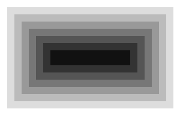

# Bro

A toy browser engine written in Go, inspired by [Robinson](https://limpet.net/mbrubeck/2014/08/08/toy-layout-engine-1.html).

Also contains:
 * a CSS Lexer / Parser: `bro/css`
 * a HTML Lexer / Parser: `bro/dom`

Available CSS propreties:
 * background-color
 * height
 * width
 * margin-left, margin-right, margin-top, margin-bottom
 * padding-left, padding-right, padding-top, padding-bottom
 * border-color
 * border-left-width, border-right-width, border-top-width, border-bottom-width
 
## Example usage

`input.html`

```html
<div class="a">
    <div class="b">
        <div class="c">
            <div class="d">
                <div class="e">
                    <div class="f">
                        <div class="g">
                            <div class="h"></div>
                        </div>
                    </div>
                </div>
            </div>
        </div>
    </div>
</div>
```

`input.css`

```css
.a { background-color: #FFFFFF; padding: 12px;}
.b { background-color: #DDDDDD; padding: 12px;}
.c { background-color: #BBBBBB; padding: 12px;}
.d { background-color: #999; padding: 12px;}
.e { background-color: #777; padding: 12px;}
.f { background-color: #555; padding: 12px;}
.g { background-color: #333; padding: 12px;}
.h { background-color: #111; padding: 12px;}
```

Command

`./bro -html input.html -css input.css -o output.png`

`output.png`



## TODO

- [ ] Ignore HTML comments and white spaces when building style tree
- [ ] Implement CSS star selector
- [ ] Add text rendering
