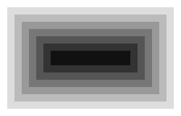

# Bro

A toy browser engine written in Go, inspired by [Robinson](https://limpet.net/mbrubeck/2014/08/08/toy-layout-engine-1.html).

## Example usage

`input.html`

```html
<div class="a">
    <div class="b">
        <div class="c">
            <div class="d">
                <div class="e">
                    <div class="f">
                        <div class="g">
                            <div class="h"></div>
                        </div>
                    </div>
                </div>
            </div>
        </div>
    </div>
</div>
```

`input.css`

```css
.a { background-color: #FFFF00FF; padding: 12px;}
.b { background-color: #FFFF00DD; padding: 12px;}
.c { background-color: #FFFF00BB; padding: 12px;}
.d { background-color: #FFFF0099; padding: 12px;}
.e { background-color: #FFFF0077; padding: 12px;}
.f { background-color: #FFFF0055; padding: 12px;}
.g { background-color: #FFFF0033; padding: 12px;}
.h { background-color: #FFFF0011; padding: 12px;}
```

Command

`./bro -html input.html -css input.css -o output.png`

`output.png`



## TODO

- [ ] change `ParseCSS` to use an `io.Reader`
- [ ] Ignore HTML comments and white spaces when building style tree
- [ ] Implement CSS star selector
- [ ] Add text rendering
